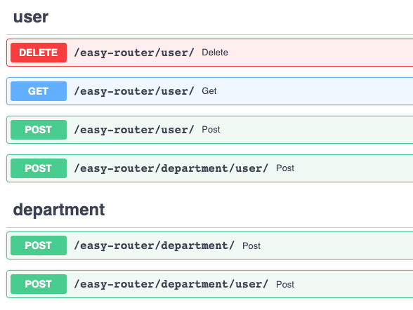

<h1>fastapi-directory-routing</h1>
<p>
  <em>Create routes easily</em></br>
  <sub>The file system-based FastAPI router automatically generates the routing structure from the file system.</sub>
</p>

```bash
  pip install fastapi-directory-routing
```

---

### Example Usage

Let's imagine a simple routing system where we can create users and departments, and add users to these departments.

Our route tree will roughly look like this.

```
/api/user [POST]
/api/user?user_id=<integer> [GET]
/api/user?user_id=<integer> [DELETE]
/api/department/add [POST]
/api/department/user [POST] # For add user to a department.
```

### Let's create this routing system with **fastapi-directory-routing**

Create your file system like this.

```
.
└── your-amazing-app/
    └── api/
        ├── user/
        │   └── route.py
        └── department/
            ├── user/
            │   └── route.py
            └── route.py
```

**fastapi-directory-routing**  traverses the folder tree in the base directory
(default is 'api' folder), and automatically adds all routes with the same
name as the router_filename (default is 'route.py') to the router

#### Define your routes in route files.
To define your routes within the route files, name your functions using 'get, post, put, delete'.

user/route.py example
```python
def get(user_id: int):
    return {
        "name": "John",
        "surname": "Doe"
    }
```

#### Adding routers to the FastAPI main router.

```python
from fastapi import FastAPI
from fastapi_directory_routing import DirectoryRouter

app = FastAPI()

easy_router = DirectoryRouter()

app.include_router(prefix="/easy-router", router=easy_router)
```

#### And 🎉


